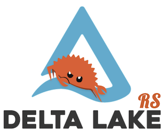

:toc: macro

= delta-rs

image:https://github.com/delta-io/delta-rs/workflows/build/badge.svg[Build Status,link=https://github.com/delta-io/delta-rs/actions]
image:https://img.shields.io/crates/v/deltalake.svg?style=flat-square[Crate,link=https://crates.io/crates/deltalake]
image:https://img.shields.io/badge/docs-rust-blue.svg?style=flat-square[Docs,link=https://docs.rs/deltalake]
image:https://img.shields.io/pypi/v/deltalake.svg?style=flat-square[Python binding,link=https://pypi.org/project/deltalake]
image:https://img.shields.io/badge/docs-python-blue.svg?style=flat-square[Docs,link=https://delta-io.github.io/delta-rs/python]

A native interface to
link:https://delta.io[Delta Lake].

toc::[]

== About

This library provides low level access to Delta tables in Rust, which can be
used with data processing frameworks like
link:https://github.com/apache/arrow/tree/master/rust/datafusion[datafusion],
link:https://github.com/ballista-compute/ballista[ballista],
link:https://github.com/nevi-me/rust-dataframe[rust-dataframe],
link:https://github.com/rajasekarv/vega[vega], etc. It also provides bindings to other higher level languages such as link:https://delta-io.github.io/delta-rs/python/[Python], Ruby, or Golang.

=== Features

**Supported backends:**

* Local file system
* AWS S3
* Azure Data Lake Storage Gen 2
* link:https://delta.io/sharing[Delta Sharing]
* :x: Google Cloud Storage see link:https://github.com/delta-io/delta-rs/issues/56[#56]

.Support features
|===
| Operation/Feature | Rust | Python | Ruby

| Read table
| :heavy_check_mark: 
| :heavy_check_mark: 
| :heavy_check_mark:

| Stream table update
| :heavy_check_mark: 
|
|

| Filter files with partitions
| :heavy_check_mark: 
| :heavy_check_mark: 
|

| Vacuum (delete stale files)
| link:https://github.com/delta-io/delta-rs/issues/97[#97]
| link:https://github.com/delta-io/delta-rs/issues/97[#97]
|

| Write transactions
| :heavy_check_mark:
|
|

| Checkpoint creation
| link:https://github.com/delta-io/delta-rs/issues/106[#106]
|
|

| High-level file writer
|
|
|

| Optimize
| link:https://github.com/delta-io/delta-rs/issues/98[#98]
|
|

|===

== Get Involved

Join link:https://dbricks.co/delta-users-slack[#delta-rs in the Delta Lake Slack workspace]

=== Development Meeting

We have a standing development sync meeting for those that are interested. The meeting is held every two weeks at **9am PST** on Tuesday mornings. The direct meeting URL is shared in the Slack channel above :point_up: before the meeting.

These meetings are also link:https://www.youtube.com/channel/UCSKhDO79MNcX4pIIRFD0UVg[streamed live via YouTube] if you just want to listen in.

=== Development

delta-rs requires the Rust compiler, which can be installed with the
link:https://rustup.rs/[rustup]
command.

Running tests can be done with `cargo test` in the root directory, or one of the directories below:

=== Rust

The `rust/` directory contains core Rust APIs for accessing Delta Lake from Rust, or for higher-level language bindings.

=== Python

The `python/` directory contains the `deltalake` Python package built on top of delta-rs

=== Ruby

The `ruby/` directory contains an early prototype of a Ruby library built on top of delta-rs
