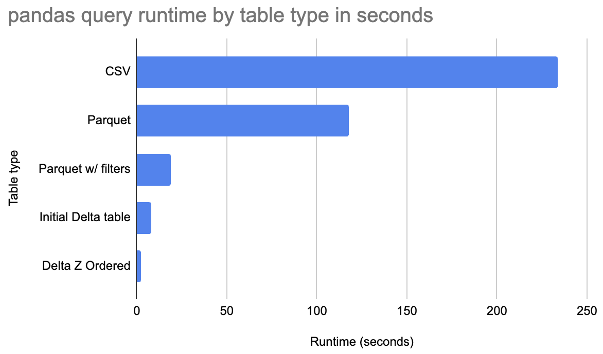

# Using Delta Lake with pandas

Delta Lake is a great storage system for pandas analyses.  This page shows how it's easy to use Delta Lake with pandas, the unique features Delta Lake offers pandas users, and how Delta Lake can make your pandas analyses run faster.

Delta Lake is very easy to install for pandas analyses, just run `pip install deltalake`.

Delta Lake allows for performance optimizations, so pandas queries can run much faster than the query run on data stored in CSV or Parquet.  See the following chart for the query runtime for the a Delta tables compared with CSV/Parquet.



Z Ordered Delta tables run this query much faster than when the data is stored in Parquet or CSV.  Let's dive in deeper and see how Delta Lake makes pandas faster.

## Delta Lake makes pandas queries run faster

There are a few reasons Delta Lake can make pandas queries run faster:

1. column pruning: only grabbing the columns relevant for a query
2. file skipping: only reading files with data for the query
3. row group skipping: only reading row groups with data for the query
4. Z ordering data: colocating similar data in the same files, so file skipping is more effective

Reading less data (fewer columns and/or fewer rows) is how Delta Lake makes pandas queries run faster.

Parquet allows for column pruning and row group skipping, but doesn't support file-level skipping or Z Ordering.  CSV doesn't support any of these performance optimizations.

Let's take a look at a sample dataset and run a query to see the performance enhancements offered by Delta Lake.

Suppose you have a 1 billion row dataset with 9 columns, here are the first three rows of the dataset:

```
+-------+-------+--------------+-------+-------+--------+------+------+---------+
| id1   | id2   | id3          |   id4 |   id5 |    id6 |   v1 |   v2 |      v3 |
|-------+-------+--------------+-------+-------+--------+------+------+---------|
| id016 | id046 | id0000109363 |    88 |    13 | 146094 |    4 |    6 | 18.8377 |
| id039 | id087 | id0000466766 |    14 |    30 | 111330 |    4 |   14 | 46.7973 |
| id047 | id098 | id0000307804 |    85 |    23 | 187639 |    3 |    5 | 47.5773 |
+-------+-------+--------------+-------+-------+--------+------+------+---------+
```

The dataset is roughly 50 GB when stored as an uncompressed CSV files.  Let's run some queries on a 2021 Macbook M1 with 64 GB of RAM.

Start by running the query on an uncompressed CSV file:

```python
(
    pd.read_csv(f"{Path.home()}/data/G1_1e9_1e2_0_0.csv", usecols=["id1", "id2", "v1"])
    .query("id1 == 'id016'")
    .groupby("id2")
    .agg({"v1": "sum"})
)
```

This query takes 234 seconds to execute.  It runs out of memory if the `usecols` parameter is not set.

Now let's convert the CSV dataset to Parquet and run the same query on the data stored in a Parquet file.

```python
(
    pd.read_parquet(
        f"{Path.home()}/data/G1_1e9_1e2_0_0.parquet", columns=["id1", "id2", "v1"]
    )
    .query("id1 == 'id016'")
    .groupby("id2")
    .agg({"v1": "sum"})
)
```

This query takes 118 seconds to execute.

Parquet stores data in row groups and allows for skipping when the `filters` predicates are set.  Run the Parquet query again with row group skipping enabled:

```python
(
    pd.read_parquet(
        f"{Path.home()}/data/G1_1e9_1e2_0_0.parquet",
        columns=["id1", "id2", "v1"],
        filters=[("id1", "==", "id016")],
    )
    .query("id1 == 'id016'")
    .groupby("id2")
    .agg({"v1": "sum"})
)
```

This query runs in 19 seconds.  Lots of row groups can be skipped for this particular query.

Now let's run the same query on a Delta table to see the out-of-the box performance:

```python
(
    DeltaTable(f"{Path.home()}/data/deltalake_baseline_G1_1e9_1e2_0_0", version=0)
    .to_pandas(filters=[("id1", "==", "id016")], columns=["id1", "id2", "v1"])
    .query("id1 == 'id016'")
    .groupby("id2")
    .agg({"v1": "sum"})
)
```

This query runs in 8 seconds, which is a significant performance enhancement.

Now let's Z Order the Delta table by `id1` which will make the data skipping even better.  Run the query again on the Z Ordered Delta table:

```python
(
    DeltaTable(f"{Path.home()}/data/deltalake_baseline_G1_1e9_1e2_0_0", version=1)
    .to_pandas(filters=[("id1", "==", "id016")], columns=["id1", "id2", "v1"])
    .query("id1 == 'id016'")
    .groupby("id2")
    .agg({"v1": "sum"})
)
```

The query now executes in 2.4 seconds.

Delta tables can make certain pandas queries run much faster.

## Delta Lake lets pandas users time travel

Start by creating a Delta table:

```python
from deltalake import write_deltalake, DeltaTable

df = pd.DataFrame({"num": [1, 2, 3], "letter": ["a", "b", "c"]})
write_deltalake("tmp/some-table", df)
```

Here are the contents of the Delta table (version 0 of the Delta table):

```
+-------+----------+
|   num | letter   |
|-------+----------|
|     1 | a        |
|     2 | b        |
|     3 | c        |
+-------+----------+
```

Now append two rows to the Delta table:

```python
df = pd.DataFrame({"num": [8, 9], "letter": ["dd", "ee"]})
write_deltalake("tmp/some-table", df, mode="append")
```

Here are the contents after the append operation (version 1 of the Delta table):

```
+-------+----------+
|   num | letter   |
|-------+----------|
|     1 | a        |
|     2 | b        |
|     3 | c        |
|     8 | dd       |
|     9 | ee       |
+-------+----------+
```

Now perform an overwrite transaction:

```python
df = pd.DataFrame({"num": [11, 22], "letter": ["aa", "bb"]})
write_deltalake("tmp/some-table", df, mode="overwrite")
```

Here are the contents after the overwrite operation (version 2 of the Delta table):

```
+-------+----------+
|   num | letter   |
|-------+----------|
|     8 | dd       |
|     9 | ee       |
+-------+----------+
```

Read in the Delta table and it will grab the latest version by default:

```
DeltaTable("tmp/some-table").to_pandas()

+-------+----------+
|   num | letter   |
|-------+----------|
|    11 | aa       |
|    22 | bb       |
+-------+----------+
```

You can easily time travel back to version 0 of the Delta table:

```
DeltaTable("tmp/some-table", version=0).to_pandas()

+-------+----------+
|   num | letter   |
|-------+----------|
|     1 | a        |
|     2 | b        |
|     3 | c        |
+-------+----------+
```

You can also time travel to version 1 of the Delta table:

```
DeltaTable("tmp/some-table", version=1).to_pandas()

+-------+----------+
|   num | letter   |
|-------+----------|
|     1 | a        |
|     2 | b        |
|     3 | c        |
|     8 | dd       |
|     9 | ee       |
+-------+----------+
```

Time travel is a powerful feature that pandas users cannot access with CSV or Parquet.

## Schema enforcement

Delta tables only allow you to append DataFrame with matching schema by default.  Suppose you have a DataFrame with `num` and `animal` columns, which is different from the Delta table that has columns with `num` and `letter` columns.

Try to append this DataFrame with a mismatched schema to the existing table:

```
df = pd.DataFrame({"num": [5, 6], "animal": ["cat", "dog"]})
write_deltalake("tmp/some-table", df)
```

This transaction will be rejected and will return the following error message:

```
ValueError: Schema of data does not match table schema
Data schema:
num: int64
animal: string
-- schema metadata --
pandas: '{"index_columns": [{"kind": "range", "name": null, "start": 0, "' + 474
Table Schema:
num: int64
letter: string
```

Schema enforcement protects your table from getting corrupted by appending data with mismatched schema.  Parquet and CSV don't offer schema enforcement for pandas users.

## Overwriting schema of table

You can overwrite the table contents and schema by setting the `overwrite_schema` option.  Here's how to overwrite the table contents:

```python
write_deltalake("tmp/some-table", df, mode="overwrite", overwrite_schema=True)
```

Here are the contents of the table after the values and schema have been overwritten:

```
+-------+----------+
|   num | animal   |
|-------+----------|
|     5 | cat      |
|     6 | dog      |
+-------+----------+
```

## In-memory vs. in-storage data changes

It's important to distinguish between data stored in-memory and data stored on disk when understanding the functionality offered by Delta Lake.

pandas loads data from storage (CSV, Parquet, or Delta Lake) into in-memory DataFrames.

pandas makes it easy to modify the data in memory, say update a column value.  It's not easy to update a column value in storage systems like CSV or Parquet using pandas.

Delta Lake makes it easy for pandas users to update data in storage.

## Why Delta Lake allows for faster queries

Delta tables store data in many files and metadata about the files in the transaction log.  Delta Lake allows for certain queries to skip entire files, which makes pandas queries run much faster.

## More resources

See this talk on why Delta Lake is the best file format for pandas analyses to learn more: 

<iframe width="560" height="315" src="https://www.youtube.com/embed/A8bvJlG6phk?si=xHVZB5LhaWfTBU0r" title="YouTube video player" frameborder="0" allow="accelerometer; autoplay; clipboard-write; encrypted-media; gyroscope; picture-in-picture; web-share" allowfullscreen></iframe>

## Conclusion

Delta Lake provides many features that make it an excellent format for pandas analyses:

* performance optimizations make pandas queries run faster
* data management features make pandas analyses more reliable
* advanced features allow you to perform more complex pandas analyses

Python deltalake offers pandas users a better experience compared with CSV/Parquet.
