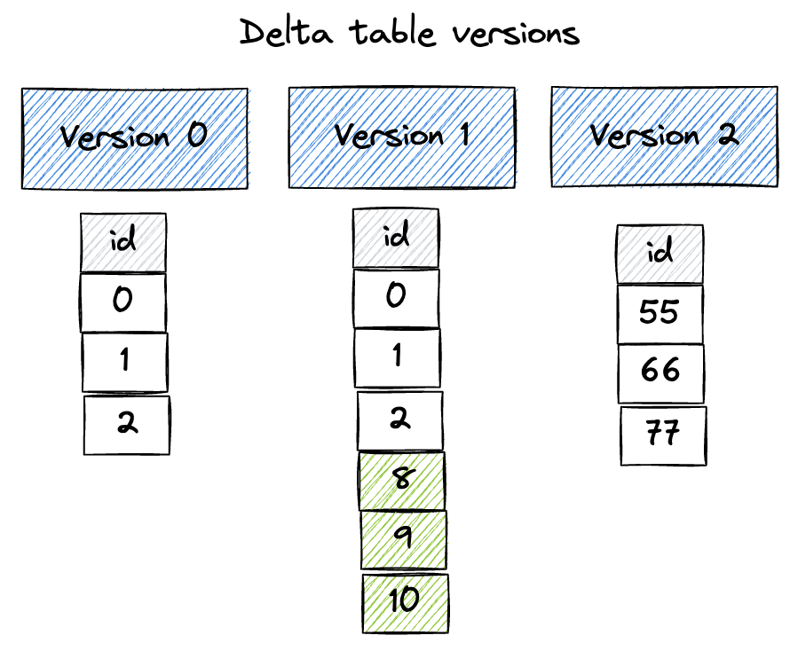
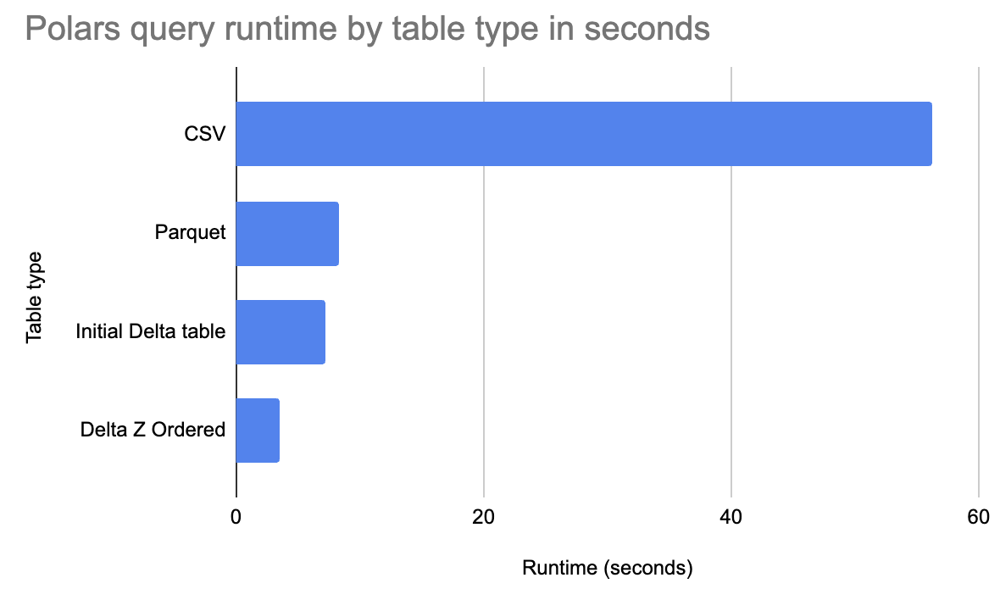

# Using Delta Lake with polars

This page explains why Delta Lake is a great storage system for Polars analyses.

You will learn how to create Delta tables with Polars, how to query Delta tables with Polars, and the unique advantages Delta Lake offers the Polars community.

Here are some amazing benefits that Delta Lake provides Polars users:

* time travel
* ACID transactions for reliable writes
* better performance with file skipping
* enhanced file skipping via Z Ordering
* ability to rollback mistakes
* and many, many more

Let's start by showing how to use Polars with Delta Lake, explore how Delta Lake can make Polars queries run faster, and then look at all the cool features Delta Lake offers Polars users.

## Creating a Delta Lake table with Polars

Create a Polars DataFrame and write it out to a Delta table:

```python
import polars as pl

df = pl.DataFrame({"x": [1, 2, 3]})
df.write_delta("tmp/bear_delta_lake")
```

Inspect the contents of the Delta table:

```
print(pl.read_delta("tmp/bear_delta_lake"))

+-----+
| x   |
| --- |
| i64 |
+=====+
| 1   |
| 2   |
| 3   |
+-----+
```

Now create another Polars DataFrame and append it to the existing Delta table:

```python
df2 = pl.DataFrame({"x": [8, 9, 10]})
df2.write_delta("tmp/bear_delta_lake", mode="append")
```

Re-inspect the contents of the Delta table:

```
print(pl.read_delta("tmp/bear_delta_lake"))

+-----+
| x   |
| --- |
| i64 |
+=====+
| 1   |
| 2   |
| 3   |
| 8   |
| 9   |
| 10  |
+-----+
```

Now overwrite the existing Delta table:

```python
df3 = pl.DataFrame({"x": [55, 66, 77]})
df3.write_delta("tmp/bear_delta_lake", mode="overwrite")
```

Inspect the Delta table:

```
print(pl.read_delta("tmp/bear_delta_lake"))

+-----+
| x   |
| --- |
| i64 |
+=====+
| 55  |
| 66  |
| 77  |
+-----+
```

The Delta table now has three versions, as shown in the following diagram:



## Time travel with Delta Lake for Polars

Time travel back to version 0 of the Delta table:

```
print(pl.read_delta("tmp/bear_delta_lake", version=0))

+-----+
| x   |
| --- |
| i64 |
+=====+
| 1   |
| 2   |
| 3   |
+-----+
```

Time travel back to version 1 of the Delta table:

```
print(pl.read_delta("tmp/bear_delta_lake", version=1))

+-----+
| x   |
| --- |
| i64 |
+=====+
| 1   |
| 2   |
| 3   |
| 9   |
| 8   |
| 10  |
+-----+
```

Read the Delta table wihout specifying a version and see how it reads the latest version by default:

```
print(pl.read_delta("tmp/bear_delta_lake"))

+-----+
| x   |
| --- |
| i64 |
+=====+
| 55  |
| 66  |
| 77  |
+-----+
```

Let's dive into how to read Delta tables with Polars in more detail and compare the query runtime performance on larger datasets.

## Reading a Delta Lake table with Polars

Let's look at the h2o groupby dataset that has 1 billion rows and 9 columns.  Here are the first three rows of the dataset:

```
+-------+-------+--------------+-------+-------+--------+------+------+---------+
| id1   | id2   | id3          |   id4 |   id5 |    id6 |   v1 |   v2 |      v3 |
|-------+-------+--------------+-------+-------+--------+------+------+---------|
| id016 | id046 | id0000109363 |    88 |    13 | 146094 |    4 |    6 | 18.8377 |
| id039 | id087 | id0000466766 |    14 |    30 | 111330 |    4 |   14 | 46.7973 |
| id047 | id098 | id0000307804 |    85 |    23 | 187639 |    3 |    5 | 47.5773 |
+-------+-------+--------------+-------+-------+--------+------+------+---------+
```

This dataset is 50GB when stored in an uncompressed CSV file.  Let's run some queries on this dataset when it's stored in different file formats with Polars.

This section will show the runtime for a query when the data is stored in CSV, Parquet, and Delta Lake and explain why Delta tables are the fastest.



Start by running a query on an uncompressed CSV file with `read_csv`:

```python
pl.read_csv("~/data/G1_1e9_1e2_0_0.csv").filter(pl.col("id1") < "id016").group_by(
    ["id1", "id2"]
).agg(pl.sum("v1").alias("v1_sum")).collect()
```

This query errors out after running for several minutes.  The machine runs out of memory.  Let's try it again with `scan_csv`.

```python
pl.scan_csv("~/data/G1_1e9_1e2_0_0.csv").filter(pl.col("id1") < "id016").group_by(
    ["id1", "id2"]
).agg(pl.sum("v1").alias("v1_sum")).collect()
```

This query runs in 56.2 seconds.

Now let's run the same query when the data is stored in a Parquet file:

```python
pl.scan_parquet("~/data/G1_1e9_1e2_0_0.parquet").filter(
    pl.col("id1") < "id016"
).group_by(["id1", "id2"]).agg(pl.sum("v1").alias("v1_sum")).collect()
```

This query runs in 8.3 seconds.  It's much faster because Polars is optimized to skip row groups in Parquet files that don't contain data that's relevant for the query.

Then run the query on newly created Delta table:

```python
pl.scan_delta("~/data/deltalake/G1_1e9_1e2_0_0", version=1).filter(
    pl.col("id1") < "id016"
).group_by(["id1", "id2"]).agg(pl.sum("v1").alias("v1_sum")).collect()
```

This query runs in 7.2 seconds.  Polars can run this query faster because it can inspect the Delta transaction log and skip entire files that don't contain relevant data before performing the ordinary Parquet row group skipping.

Finally run the query on the Delta table after it has been Z Ordered by `id1`:

```python
pl.scan_delta("~/data/deltalake/G1_1e9_1e2_0_0", version=2).filter(
    pl.col("id1") < "id016"
).group_by(["id1", "id2"]).agg(pl.sum("v1").alias("v1_sum")).collect()
```

This query runs in 3.5 seconds.  The query on the Z Ordered Delta table is even faster because similar data has been co-located in the same files.  This allows for even greater data skipping.

Polars can leverage file skipping to query Delta tables very quickly.

## Why Polars is fast with Delta Lake

Delta tables consist of metadata in a transaction log and data stored in Parquet files.

When Polars queries a Delta table, it starts by consulting the transaction log to understand the metadata of each file in the Delta table.  This allows for Polars to quickly identify which files should be skipped by the query.

CSV files don't contain any such metadata, so file skipping isn't an option.  Polars can skip Parquet files based on metadata, but it needs to open up each file and read the metadata, which is slower that grabbing the file-level metadata directly from the transaction log.

Parquet doesn't allow users to easily Z Order the data and colocate similar data in the same row groups.  The Z Order optimizations are only supported in Delta tables.

Delta Lake offers Polars users with unique performance optimizations.

## Other Delta Lake features relevant for Polars users

* ACID transactions for reliable writes
* better performance with file skipping
* enhanced file skipping via Z Ordering
* ability to rollback mistakes

## Conclusion

This guide shows how Delta Lake is a great storage format for Polars analyses.

Delta Lake is easy to use, fast, and full of features that are great for Polars users.
