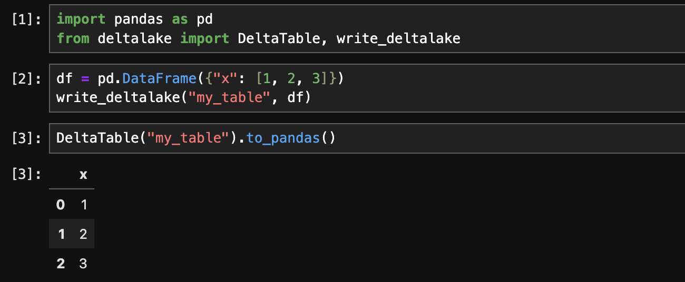

# Installation

The `deltalake` project can be installed via pip for Python or Cargo for Rust.

## Install Delta Lake for Python

With pip:

``` bash
pip install deltalake
```

With Conda:

```bash
conda install -c conda-forge deltalake
```

## Install Delta Lake for Rust

With Cargo:

``` bash
cargo add deltalake
```

## Run Delta Lake and pandas in a Jupyter Notebook

You can easily run Delta Lake and pandas in a Jupyter notebook.

Create an environment file with the dependencies as follows:

```yaml
name: deltalake-minimal
channels:
  - conda-forge
  - defaults
dependencies:
  - python=3.11
  - ipykernel
  - pandas
  - polars
  - jupyterlab
  - pip
  - pip:
    - deltalake
```

Create a virtual environment with the dependencies:

```bash
conda env create -f deltalake-minimal.yml
```

Open the Jupyter notebook and run commands as follows:


