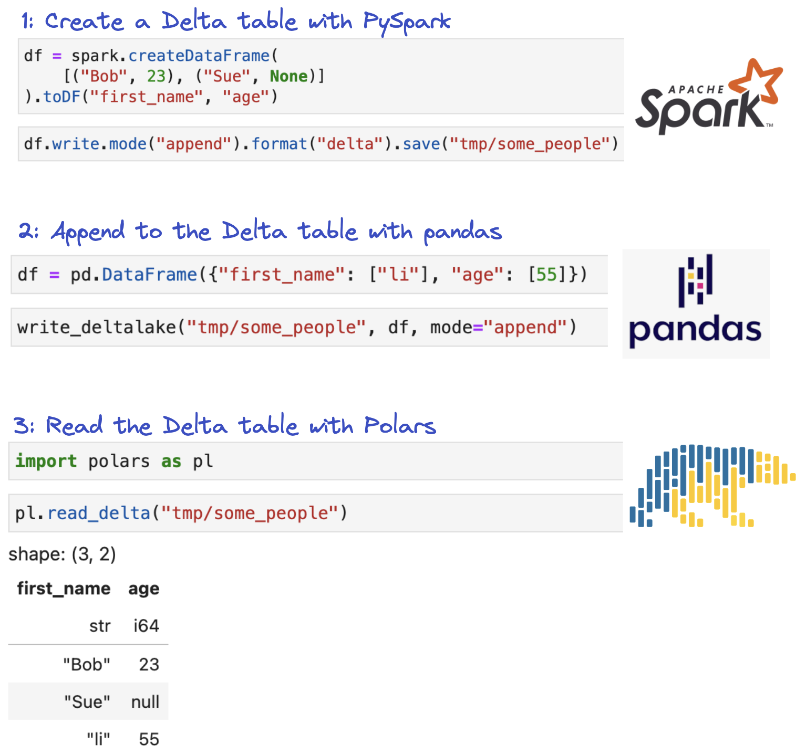

# Why use Delta Lake

This page explains why Delta Lake is a better storage format for most tabular data analyses than data lake alternatives.

Delta Lake provides developer-friendly features, reliable transactions, and fast performance compared with alternatives like Parquet or CSV.

## Fast performance

Delta tables store data in Parquet files and persist file-level metadata in the transaction log.

This offers two main performance advantages:

* File skipping based on metadata that’s quickly accessible
* Easy identification of all file paths for the table, compared to file listing operations that can be slow, especially on cloud object stores

Delta Lake stores min/max values for each column of each file in the table.  Certain queries can skip entire files based on the metadata.  File skipping can be a massive performance optimization.

Delta Lake also makes it easy to rearrange data in the table, so more file skipping is possible.  For example, the table can be partitioned or Z Ordered, so that similar data is colocated in the same files and data skipping is optimal for your query patterns.

For data lakes, you need to run file listing operations to get the file paths before you can actually read the data.  Listing all the files in a data lake can take a long time, especially if there are a lot of files and they are stored in Hive-style partitions.

Delta Lake stores all the file paths in the transaction log.  So you can quickly get the file paths directly from the log and then run your query.  Delta Lake also stores the file-level metadata in the transaction log which is quicker than opening all the files in the data lake and grabbing the metadata from the file footer.

## Developer friendly features

Many basic data operations are hard in data lakes but quite easy with Delta Lake.  The only data operation that’s easy with a data lake is appending data.  Delta Lake makes all data operations easy including the following:

* Appends
* Upserts
* Deletes
* Replace where

Even deleting a few rows of data from a data lake is hard.  It’s even harder if you want to run the operation in a performant manner.

Delta Lake makes it easy to run common data operations and executes them performantly under the hood.

Delta Lake also executes write operations as transactions, which makes data operations safer and prevents downtime.  Write operations will cause data lakes to be in an unstable state while the computations is running.  For example, if you read a data lake while a delete operation is running, then you may get the wrong data.

Let’s explore the benefits of reliable transactions in more detail.

## Reliable transactions

Delta Lake supports transactions which means that write operations have the following characteristics:

* They either finish completely or don’t run at all
* They are executed in a serial manner and don’t conflict with other transactions
* They don’t corrupt a table or violate table constraints

Data lakes don’t support transactions, so the write operations can cause the following errors:

* There is no schema enforcement, so you can append data to a data lake with a mismatching schema
* Reading the data lake often yields incorrect results while write transactions are performed
* Data lakes can be corrupted for invalid write operations or computations that error-out
* Concurrent transactions that conflict can cause data loss

Production data systems should rely on storage systems like Delta Lake that support transactions.

## Interoperability

Delta Lake tables are interoperable and can be read/written by multiple different query engines.

For example, you can create a Delta table with Spark, append to it with pandas, and then read it with Polars.

Delta tables are powerful because they are interoperable with various query engines and computation runtimes.

Suppose you have a Delta table that’s updated with an AWS Lambda function every 5 minutes.  There is only a small amount of data collected every 5 minutes, so a lightweight runtime like AWS Lambda is sufficient.

Further suppose that the overall table is quite large.  So when you want to perform DML operations or query the whole table, your team uses a Spark cluster.

Delta Lake is flexible to allow these types of operations from multiple readers and writers.  This provides teams with the flexibility to choose the right tool for the job.

## Support for many languages

Delta tables can be queried with a variety of different languages.  This project provides APIs for Rust and Python users and does not depend on Java or Scala.  This project is a great alternative for pandas, Polars, DuckDB, or DataFusion.

Delta Lake supports many languages and even more language support is coming soon!

## Support on multiple clouds

Delta Lake supports multiple clouds including GCP, AWS, and Azure.

You can also use Delta Lake on your local machine or in an on-prem environment.

Delta Lake is quite portable.

## Conclusion

Delta Lake is a mature table format that offers users tons of advantages over a data lake with virtually no downsides.

Once you start using Delta Lake, you will never want to go back to data lakes that expose you to a variety of dangerous bugs, poor performance, and reliability issues.

The Delta Lake community is also welcome and open.  We gladly accept new contributors and help users with their questions.
